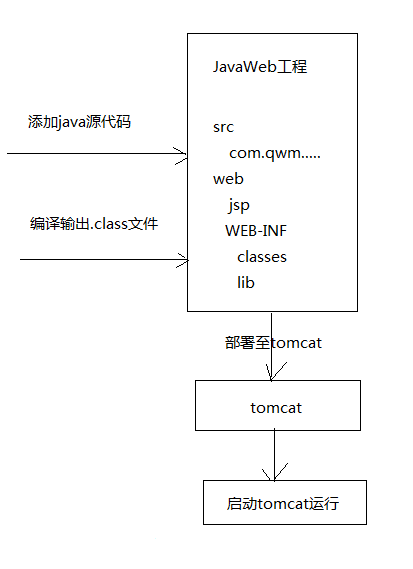
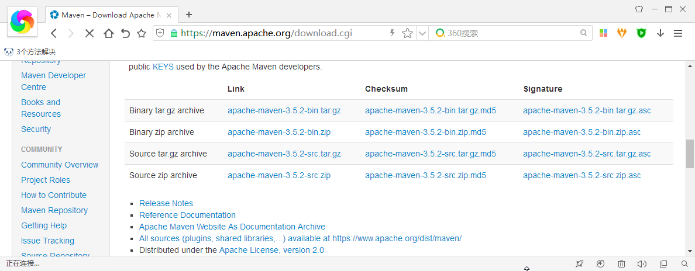
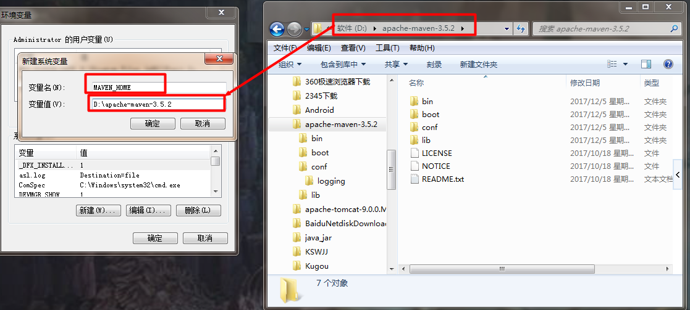
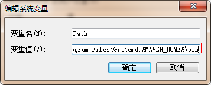
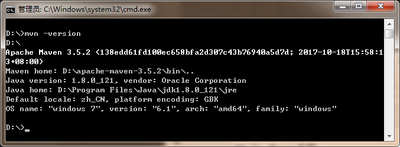

[TOC]

# maven 学习
[Maven学习01——Maven介绍与安装](blog/01.md)


-----

# Maven学习01——Maven介绍与安装

## 一、Maven介绍

### 1.1 Maven是什么

**Maven**是 [Apache](http://www.apache.org/) 下的一个纯java开发的开源项目。

它是一个项目管理工具。使用Maven对java项目进行构建、依赖管理。


### 1.2 什么是项目构建

项目构建是一个项目从编写源码到编译、测试、运行、打包、部署、运行的过程

### 1.3 传统项目构成过程

传统项目构建过程如下：



构建过程如下：
> 1 在开发工具中创建java web工程
>
> 2 在工程中编写源代码及配置文件等
>
> 3 对源代码进行编译，java文件编译成class文件
>
> 4 执行junit单元测试
>
> 5 将工程打成war包部署至tomcat运行

### 1.4 Maven项目的构建过程

Maven将项目构建的过程进行标准化，每个阶段使用一个命令完成，下图展示构建

的一些阶段，大致如下


上图中部分阶段对应的命令如下：
> 清理阶段对应 **maven** 的命令是 **clean**，清理输出的class文件
>
> 编译阶段对应 **maven** 的命令是 **compile**，将java代码编译成class文件
>
> 打包阶段对应 **maven** 的命令是 **package**，java工程可以打成jar包，web项目可以打成war包

**运行 maven 工程（web工程）需要一个命令：tomcat:run**

maven工程构建的优点：
> 1 一个命令完成构建、运行，方便快捷
>
> 2 maven对每个构建阶段进行规范，非常有利于大团队协作开发

---

## 二、依赖管理

### 2.1 什么是依赖管理

什么是依赖？

一个java项目可能要使用一些第三方jar包才可以运行，那么我们就说这个java项目依赖了这些第三方jar包

例如：crm系统，它的架构是SSH框架，该crm项目依赖SSH框架，具体它依赖 Struts2、Hibernate、Spring

什么是依赖管理？

依赖管理就是对项目所有依赖的jar包进行规范化管理。


### 2.2 传统项目的依赖管理

传统的项目工程要管理所依赖的jar包完全靠人工进行，从网上下载jar包添加到项目工程中。

手工拷贝jar包添加到工程中的问题是：
> 1 没有对jar包的版本统一管理，容易导致版本冲突
>
> 2 从网上找jar包非常不方便，有些jar找不到
>
> 3 jar包添加到工程中导致工程过大


### 2.3 maven项目的依赖管理

maven项目所依赖的jar包不需要手动项目中添加jar包，只需要在 **pom.xml(maven工程的配置文件)**

添加jar包的坐标，自动从maven仓库中下载jar包、运行，如图：


使用maven依赖管理添加jar包的好处
> 1 通过pom.xml文件对jar包版本进行统一管理，可以避免版本冲突
>
> 2 maven团队维护了一个非常安全的maven仓库，里面包括了当前使用的jar包，maven工程可以自动从maven
> 仓库下载jar包，非常方便。

----

### 2.4 使用maven的好处

通过上面介绍传统项目和maven项目在构建及依赖管理方便的区域，maven有如下的好处：

1. 一步构建
> maven对项目构建的过程进行标准化，通过一个命令即可完成构成过程

2. 依赖管理
> maven工程不用手动到如jar包，通过pom.xml中定义坐标从maven仓库自动下载，方便而且不易出错

3. maven跨平台

4. maven遵循规范开发有利于提供大型团队的开发效率，降低项目的维护成本


---

## 三、Maven安装

### 3.1 maven下载

下载地址 : [https://maven.apache.org/download.cgi](https://maven.apache.org/download.cgi)

如图



### 3.2 maven安装
**配置环境变量 MAVEN_HOME**

下载完成以后，解压。

电脑的java环境，**3.3+**以上必须是 JDK1.7+版本

```xml
Maven 3.3+ require JDK 1.7 or above to execute - they still allows you to build against 1.3 and other JDK versions by Using Toolchains
```

配置环境变量如下图





打开控制台输入 **mvn -version**，查看版本

